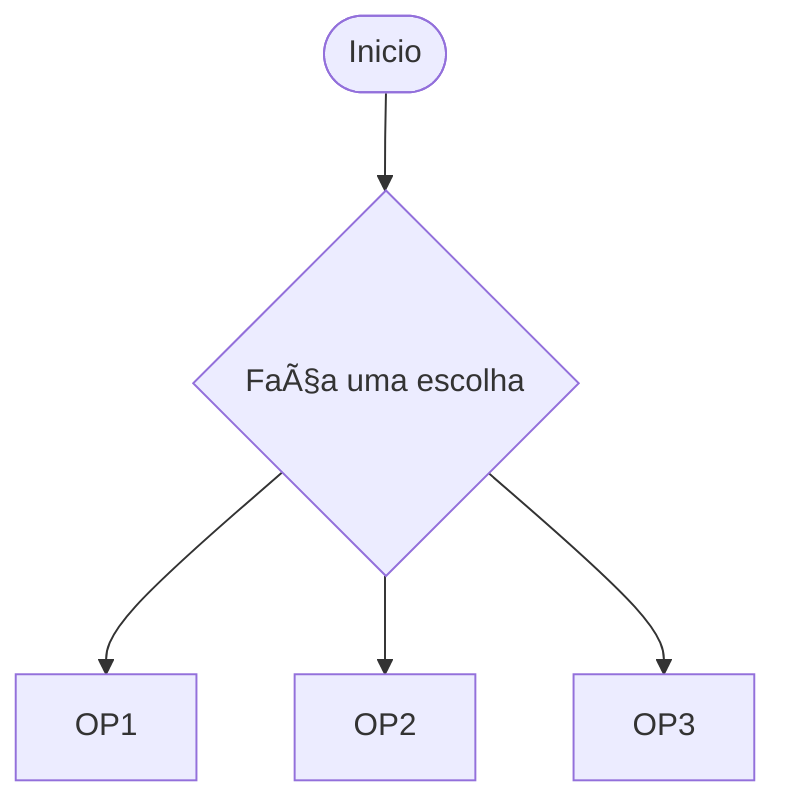
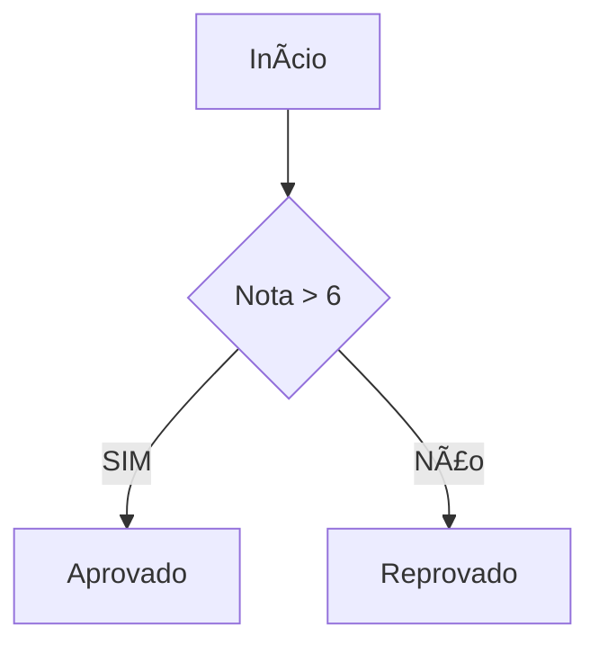
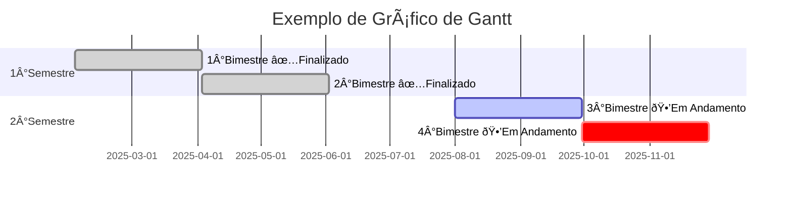

```mermaid
flowchart TD
  A(["Inicio"])
  A --> B{"Faça uma escolha"}
  B --> C["OP1"]
  B --> D["OP2"]
  B --> E["OP3"]
```

```mermaid
graph TD;
  A["Início"] --> B{Nota > 6};
  B --> |SIM| C[Aprovado];
  B --> |Não| D[Reprovado];
```

```mermaid
gantt
  title Exemplo de Gráfico de Gantt
  dateFormat YYYY-MM-DD
  section 1°Semestre
  1°Bimestre ✅Finalizado:done, a1, 2025-02-02, 60d
  2°Bimestre ✅Finalizado:done, a2, after a1, 60d
  section 2°Semestre
  3°Bimestre 🕒Em Andamento:active, a3, 2025-08-01, 60d
  4°Bimestre 🕒Em Andamento:crit, a4, after a3, 60d
```
